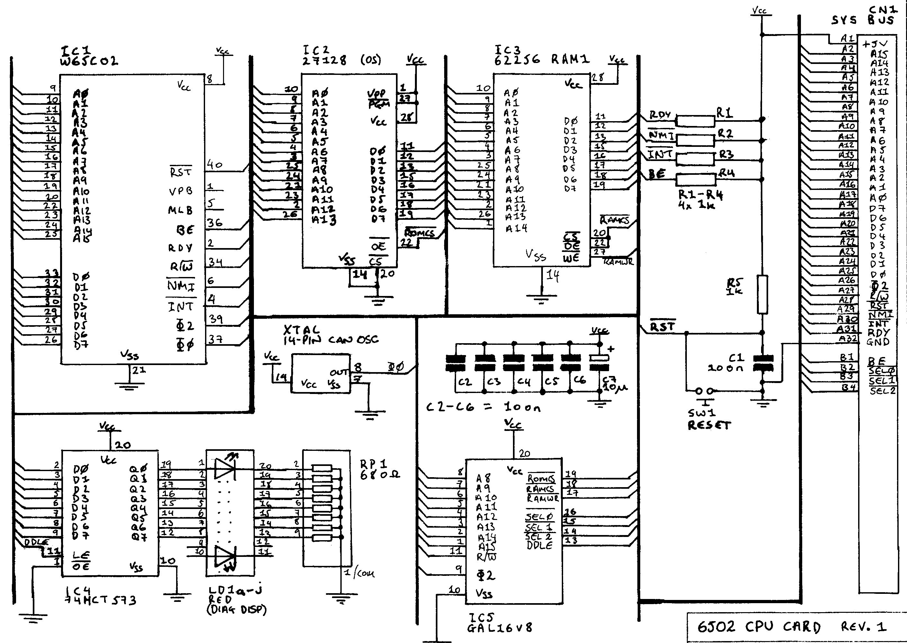

# Yet another NES Emulator written in C++


[](https://travis-ci.org/elvircrn/NESEmu)



# Build

I use [CMRC](https://vector-of-bool.github.io/2017/01/21/cmrc.html) for resource management.

For some god-forsaken reason, gcc builds fail both on Mac and Windows. MSVC and clang should
work as expected, bearing in mind the specifics of each one's C++ implementation.

# Conan
```
cd ~/NESEmu
pip3 install conan
conan remote add bincrafters https://api.bintray.com/conan/bincrafters/public-conan
```

# Windows
## Visual Studio(MSVC)

Visual studio has a weird cmake/conan interaction explained here:
https://docs.conan.io/en/1.3/howtos/vs2017_cmake.html
Furthermore, the contents of `.conan/profiles/default` which contain the settings that I 
used for compiling under VS and MSVC are as follows:
```
conan install . -if=C:/Users/elvircrn/CMakeBuilds/0730974a-797b-6738-a0b9-9daee0626596/build/x64-Debug --build=missing -s os=Windows -s os_build=Windows -s arch=x86_64 -s arch_build=x86_64 -s build_type=Release -s compiler="Visual Studio" -s compiler.version=15


```
# Mac OS X

```
conan install . --install-folder=cmake-build-debug  --build=missing -s compiler=apple-clang -s compiler.version=10.0 -s compiler.libcxx=libc++ -s build_type=Debug
```

# TODOs
Refactor branches into a single method

# ROM data
0 = 4E (N)\
1 = 45 (E)\
2 = 53 (S)\
3 = 1A (Character Break, necessary!)

(Bytes 4->8-15 Can BE MODIFIED!)\
4 = PRG (Hex number depends on size of PRG file)\
5 = CHR (Hex number depends on size of CHR file)\
6 = Mapper 0-15/ V or H Mirroring, Battery, 4 Screen VRAM, Trainer Switches
    Also is used as the "Ones" place holder digit for the extended iNES Header
    format. (See Sect. 2)\
7 = Mappers 16-?, the extended iNES Header format "Tens" place holder digit.
    Again (See Sect. 2 for details on how this is set up.)\
8->15 = Not used at this tume but MUST BE ALL ZEROS or games will not work.


# PPU
## Registers
    0 = Always zero              1 = Always 1
    - = Not used                 ? = Unknown

    +---------+----------------------------------------------------------+
    | Address | Description                                              |
    +---------+----------------------------------------------------------+
    |  $2000  | PPjkU Control Register #1 (W)                   [PPUCNT0]  |
    |         |   %vMsbpiNN                                              |
    |         |               v = execute NMI on VBlank                  |
    |         |                      1 = Enabled                         |
    |         |               M = PPU Selection (unused)                 |
    |         |                      0 = Master                          |
    |         |                      1 = Slave                           |
    |         |               s = Sprite Size                            |
    |         |                      0 = 8x8                             |
    |         |                      1 = 8x16                            |
    |         |               b = Background Pattern Table Address       |
    |         |                      0 = $0000 (VRAM)                    |
    |         |                      1 = $1000 (VRAM)                    |
    |         |               p = Sprite Pattern Table Address           |
    |         |                      0 = $0000 (VRAM)                    |
    |         |                      1 = $1000 (VRAM)                    |
    |         |               i = PPU Address Increment                  |
    |         |                      0 = Increment by 1                  |
    |         |                      1 = Increment by 32                 |
    |         |              NN = Name Table Address                     |
    |         |                     00 = $2000 (VRAM)                    |
    |         |                     01 = $2400 (VRAM)                    |
    |         |                     10 = $2800 (VRAM)                    |
    |         |                     11 = $2C00 (VRAM)                    |
    |         |                                                          |
    |         | NOTE: Bit #6 (M) has no use, as there is only one (1)    |
    |         |       PPU installed in all forms of the NES and Famicom. |
    +---------+----------------------------------------------------------+
    |  $2001  | PPU Control Register #2 (W)                   [PPUCNT1]  |
    |         |   %fffpcsit                                              |
    |         |             fff = Full Background Colour                 |
    |         |                    000 = Black                           |
    |         |                    001 = Red                             |
    |         |                    010 = Blue                            |
    |         |                    100 = Green                           |
    |         |               p = Sprite Visibility                      |
    |         |                      1 = Display                         |
    |         |               c = Background Visibility                  |
    |         |                      1 = Display                         |
    |         |               s = Sprite Clipping                        |
    |         |                      0 = Sprites not displayed in left   |
    |         |                          8-pixel column                  |
    |         |                      1 = No clipping                     |
    |         |               i = Background Clipping                    |
    |         |                      0 = Background not displayed in     |
    |         |                          left 8-pixel column             |
    |         |                      1 = No clipping                     |
    |         |               t = Display Type                           |
    |         |                      0 = Colour display                  |
    |         |                      1 = Mono-type (B&W) display         |
    +---------+----------------------------------------------------------+

### PPUCTRL0 (PPUCTRL)
* Selects the Name table to display
* Sets the ppu address increment (for reading/writing)
* Sets the address within the pattern table for sprite tiles
* Sets the address within the pattern table for background tiles
* Selects the sprite size (8x8 or 8x16)
* Sets whether to execute an interupt when drawing sprite 0
* Sets whether to execute an interupt during the Vblank period

### PPUCTRL1 (PPUMASK)
* Sets the disply to color or mono-tone
* Sets whether to clip the left 8 pixels of the background
* Sets whether to clip sprites within the left 8 pixels of the background
* Sets whether to display the screen or not
* Selects the screen background color (black, red, blue, green)

### PPUSTATUS
* Returns whether PPU is in a Vblank period
* Returns whether there are more than 8 sprites on the current scanline
* Returns whether sprite 0 has been drawn on the current scanline


# Notes on cycle counting:

Every instruction takes at least two cycles.

## Base cycle costs
immediate     +0\
zeropage      +1\
zeropage,x    +2\
zeropage,y    +2\
absolute      +2\
absolute,x    +2\
absolute,y    +2\
(indirect,x)  +4\
(indirect),y  +3

## OAM
The OAM (Object Attribute Memory) is internal memory inside the PPU that 
contains a display list of up to 64 sprites, where each sprite's information 
occupies 4 bytes.

## NOP

## Relative Addressing Mode
Only used by branches, no need to call tick().

## Instructions that call tick() directly:
PHP +1\
PHA +1\
PLA +2\
PLP +2

## Register transfers
Instructions starting with T do not require any extra cycles!

## Branches
Branches take an extra cycle if the branch is taken and another if zero is
crossed(not calculated).

## Flag clears
Do not take any aditional cycles.

## Accumulator addressing
Any instruction that uses this mode does not take any additional cycles

## Sets
Do not take any aditional cycles.

## Stores
Not affected by zeropage crossing
zeropage   +1\
zeropage,x +2\
zeropage,y +2\
absolute   +2\
(indirect,x) +4\
\
absolute,x   +3\
absolute,y   +3\
(indirect),y +4

## Returns
4 additional cycles.
RTI -> PLP(Pop8)  +2
       Pop16      +2?
RTS -> Pop16 +2

## BIT
zeropage +1\
absolute +2

## Compares
immediate +0\
zeropage  +1\
absolute  +2

### CMP
zeropage,x +2\
absolute,x [+2]\
absolute,y [+2]\
(indirect,x) +4\
(indirect),y [+3]


## Incremenets Decrements
Not affected by zeropage crossing

zeropage +3\
zeropage,x +4\
absolute +4\
absolute,x +5

INX, INY, DEX and DEY do not require any additional cycles.

## Jumps
### JMP
absolute +1\
indirect +3

### JSR
absolute +4

## Loads
immediate     +0\
zeropage      +1\
zeropage,x    +2\
absolute      +2\
absolute,x    [+2]\
absolute,y    [+2]\
(indirect,x)  +4\
(indirect),y  [+3]

## Shifts and rotations
accumulator   +0\
zeropage      +3\
zeropage,s    +4\
absolute      +4\
absolute,x    +5

## ADC, SBC, EOR, ORA, AND
immediate     +0\
zeropage      +1\
zeropage,x    +2\
absolute      +2\
absolute,x    [+2]\
absolute,y    [+2]\
(indirect,x)  +4\
(indirect),y  [+3]

http://web.textfiles.com/games/
http://web.textfiles.com/games/nestech.txt

# How NES Graphics work
## The Basics
---------------------

All the graphical information is stored within the 16kb memory of
the Picture Processing Unit (PPU).

The first area of PPU memory is known as the "Pattern Tables."  The
pattern tables are 8kb in size, which is usually split in half, one part
for the background, the other for sprites.  The usage of the pattern tables
is determined by the PPU control registers.  All graphics are stored in 8x8
pixel "tiles" within the pattern tables which are arranged to form
backgrounds and sprites.  The pattern tables (also known as VROM) contains
half the graphics information for these tiles.  The NES is capable of
displaying 16 colors at once, since each pixel is 4 bits that are a lookup of
the palette.  The pattern table contains the low two bits, and the upper two
either come from the attribute table (for the background) or from sprite
ram (for sprites).

Some roms contain what is known as CHR-RAM.  CHR-RAM stands for
CHaRacter RAM and contains 8kb banks of pattern tables which can be swapped
in and out of the PPU via an MMC.  This saves the trouble of copying it
from within the program code to the PPU like games without CHR-RAM do.

The second area of PPU memory is known as "Name Tables."  There are
usually two, although there are addresses for 4.  The other two are mirrors
of the actual tables, which is determined by the mirroring bit of the .NES
header.  Each name table is 960 bytes, which corresponds with 960 8x8 tiles
that make up the background.  The background is 32x30 tiles, or 256x240 pixels.
In a NTSC NES, however, the top and bottom 8 lines are not displayed, making
the actual resolution 256x224.  Note that some games use only one name table,
and others can use 4.  These settings are dependant on the memory mapper used.

Paired with each name table is an attribute table.  These tables
contain the upper two bits of each pixel's color that are matched with the
lower two bits from the pattern table.  However, the attribute table is only
64 bytes in size, meaning that each byte contains the upper two bits for a
group of 4x4 tiles (or 32x32 pixels).  This puts a limitation on your choice
of colors in the background.  However, you can get around the attribute table
limitation by using MMC5, which allows you to use 4 name tables and the
upper two bits for each individual tile.  For more information, read
Y0SHi's very informative NESTECH.DOC

Also stored in PPU memory are two 16 color palettes.  One is used for
the background, the other for sprites.  These are not actual rgb palettes, but
lookup tables of a 256 color palette that the PPU translates into tv signals.
You can modify the values stored in the palette, allowing you to create many
effects such as fades, flashing, or transparency.

There is an independent area of memory known as sprite ram, which is
256 bytes in size.  This memory stores 4 bytes of information for 64 sprites.
These 4 bytes contain the x and y location of the sprite on the screen, the
upper two color bits, the tile index number (pattern table tile of the sprite),
and information about flipping (horizontal and vertical), and priority
(behind/on top of background).  Sprite ram can be accessed byte-by-byte through
the NES registers, or also can be loaded via DMA transfer through another
register.

There are various other aspects of the PPU that can be controlled via
several nes registers.  Here's a list of registers and what they do:

PPU Control register 1 (PPUCTRL0):
* Selects the Name table to display
* Sets the ppu address increment (for reading/writing)
* Sets the address within the pattern table for sprite tiles
* Sets the address within the pattern table for background tiles
* Selects the sprite size (8x8 or 8x16)
* Sets whether to execute an interupt when drawing sprite 0
* Sets whether to execute an interupt during the Vblank period

PPU Control register 2 (PPUCTRL1):
* Sets the disply to color or mono-tone
* Sets whether to clip the left 8 pixels of the background
* Sets whether to clip sprites within the left 8 pixels of the background
* Sets whether to display the screen or not
* Selects the screen background color (black, red, blue, green)

PPU Status register (PPUSTAT):
* Returns whether PPU is in a Vblank period
* Returns whether there are more than 8 sprites on the current scanline
* Returns whether sprite 0 has been drawn on the current scanline

Background Scroll (BGSCROLL):
* Sets the horizontal and vertical scroll (written to twice)